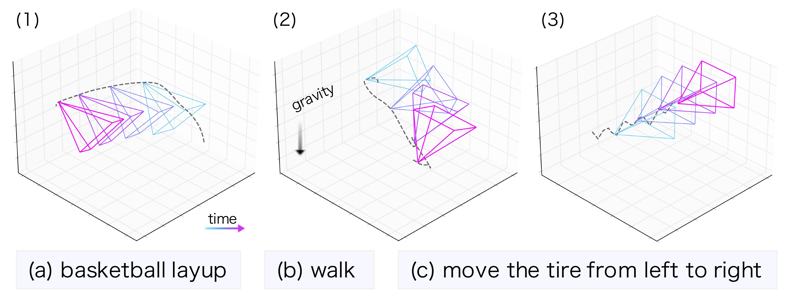
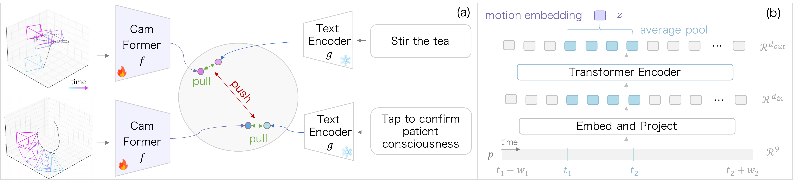

# Seeing without Pixels: Perception from Camera Trajectories

[Seeing without Pixels: Perception from Camera Trajectories](https://arxiv.org/abs/2511.21681)

[Zihui Xue](https://zihuixue.github.io/), [Kristen Grauman](https://www.cs.utexas.edu/~grauman/), [Dima Damen](https://dimadamen.github.io/), [Andrew Zisserman](https://www.robots.ox.ac.uk/~az/), [Tengda Han](https://tengdahan.github.io/)

CVPR 2026

[Project page](https://sites.google.com/view/seeing-without-pixels) | [arXiv](https://arxiv.org/abs/2511.21681) | [Data and checkpoints](DATA.md) | [Citation](#citation)

---

Can we understand a video from camera motion alone, without seeing any pixels?

<p align="left">
  
</p>

Our paper shows that camera trajectories carry surprisingly rich semantic information. CamFormer takes only the camera's path through 3D space and learns to align it with natural-language descriptions, making it possible to retrieve what is happening in a video from motion alone.

---

This repository contains the released code for CamFormer pretraining and 5-way multiple-choice retrieval evaluation on:

- Ego-Exo4D, using egocentric Aria camera trajectories
- DynPose-100K, using exocentric camera trajectories
- Nymeria, for egocentric zero-shot transfer

The code operates on camera-pose trajectories only; no video frames are used.

## Method

<p align="left">
  
</p>

CamFormer is a four-layer Transformer over camera poses. It maps a pose sequence to a single motion embedding and trains it against the frozen CLIP text encoder with a contrastive trajectory-text loss. For egocentric data, the model can encode a longer temporal context around each labeled action, then pool only the labeled sub-window. This helps disambiguate short or visually sparse camera motions.

## Setup

Create the conda environment:

```bash
conda env create -f environment.yml
conda activate camformer
```

Or install into an existing Python 3.9+ environment:

```bash
pip install -r requirements.txt
```

The CLIP text encoder is installed from GitHub, so `git` must be available. If the pinned PyTorch wheels do not match your CUDA version, install `torch` and `torchvision` from [pytorch.org](https://pytorch.org) first, then install the rest of `requirements.txt`.

## Data

The metadata CSVs are included in `data_files/`. Large derived artifacts are hosted separately:

- precomputed retrieval features, for reproducing results without a GPU
- pretrained CamFormer checkpoints
- camera-pose trajectory archives for training or checkpoint evaluation

See [DATA.md](DATA.md) for the download link, archive list, expected directory layout, and environment variables.

## Fastest Reproduction

To reproduce retrieval numbers without downloading trajectories, download `camformer_retrieval_features.zip` from [DATA.md](DATA.md), unzip it in this repository, and run:

```bash
python eval_retrieval.py retrieval_features/egoexo4d
python eval_retrieval.py retrieval_features/dynpose_original
python eval_retrieval.py retrieval_features/dynpose_vipe
python eval_retrieval.py retrieval_features/nymeria_a
python eval_retrieval.py retrieval_features/nymeria_b
python eval_retrieval.py retrieval_features/nymeria_c
python eval_retrieval.py retrieval_features/nymeria_d
```

The main metric is `Motion->Text MCQ acc`.

## Evaluation From Checkpoints

To run the model yourself, download `camformer_checkpoints.zip` and the pose archive for the dataset you want to evaluate. Set the environment variables described in [DATA.md](DATA.md), then run one of the commands below.

Ego-Exo4D, using Aria ground-truth poses:

```bash
python train.py --dataset egoexo4d_pretrain_longseq --test --scenario all \
    --pose_encoding rel9d_grav --take_duration 8 --sample_dur \
    --num_gpus 1 --batch_size 1000 \
    --init_ckpt checkpoints/egoexo4d_dur8.pt
```

DynPose-100K, using original dataset poses:

```bash
python train.py --dataset dynpose_pretrain --test \
    --pose_source original --pose_encoding rel9d \
    --num_gpus 1 --batch_size 1000 \
    --init_ckpt checkpoints/dynpose100k_original.pt
```

DynPose-100K, using ViPE-estimated poses:

```bash
python train.py --dataset dynpose_pretrain --test \
    --pose_source vipe --pose_encoding rel9d \
    --num_gpus 1 --batch_size 1000 \
    --init_ckpt checkpoints/dynpose100k_vipe.pt
```

Nymeria zero-shot transfer, using the Ego-Exo4D long-context checkpoint:

```bash
python train.py --dataset nymeria_pretrain --test \
    --text_column a --pose_encoding rel9d_grav \
    --num_gpus 1 --batch_size 1000 \
    --init_ckpt checkpoints/egoexo4d_dur16.pt
```

For Nymeria, `--text_column` selects the narration type:

- `a`: body posture
- `b`: hands and arms motion
- `c`: legs and feet motion
- `d`: focus of attention

Each `--test` run prints the directory where it saved `frames.pt` and `text.pt`. Pass that directory to `eval_retrieval.py`.

## Pretraining

Training requires the corresponding pose archives from [DATA.md](DATA.md). The common settings are:

- `--pose_encoding rel9d_grav`: relative 9D pose plus gravity in camera coordinates, used for egocentric checkpoints
- `--pose_encoding rel9d`: relative 9D pose without gravity, used for DynPose-100K
- `--take_duration`: number of seconds of context around each labeled action
- `--sample_dur`: randomly vary the context duration during training
- `--pose_source`: DynPose-100K pose source, either `original` or `vipe`
- `--use_pi3_pose`: use Pi3-estimated Ego-Exo4D poses instead of Aria ground truth

Ego-Exo4D, Aria ground-truth poses:

```bash
python train.py --dataset egoexo4d_pretrain_longseq \
    --pose_encoding rel9d_grav --take_duration 8 --sample_dur
```

Ego-Exo4D, Pi3-estimated poses:

```bash
python train.py --dataset egoexo4d_pretrain_longseq \
    --use_pi3_pose --pose_encoding rel9d_grav \
    --take_duration 8 --sample_dur
```

DynPose-100K, original poses:

```bash
python train.py --dataset dynpose_pretrain \
    --pose_source original --pose_encoding rel9d
```

DynPose-100K, ViPE-estimated poses:

```bash
python train.py --dataset dynpose_pretrain \
    --pose_source vipe --pose_encoding rel9d
```

Training writes logs under `~/data/logs/<dataset>/<job_name>/`. W&B logging is enabled by default; run `wandb login` first, or set `WANDB_MODE=offline` if you want local-only runs.

## Data Preparation

The released metadata and pose archives are enough for training and evaluation. If you want to rebuild the Ego-Exo4D long-sequence files from the raw Ego-Exo4D release, place the raw data under `~/data/egoexo4d` and run:

```bash
python -m data_prep.step1_extract_segments --mode train
python -m data_prep.step2_clean --mode train
python -m data_prep.step3_build_longseq --mode train --duration 30

python -m data_prep.step1_extract_segments --mode val
python -m data_prep.step2_clean --mode val
python -m data_prep.step3_build_longseq --mode val --duration 30
```

Then set `EGOEXO4D_PRETRAIN_TRAJ_DIR` to the generated `camera_motion_cache/egoexo4d_pretrain` directory.

## Citation

If you use this code or data release, please cite:

```bibtex
@inproceedings{xue2026seeing,
  title={Seeing without Pixels: Perception from Camera Trajectories},
  author={Xue, Zihui and Grauman, Kristen and Damen, Dima and Zisserman, Andrew and Han, Tengda},
  booktitle={Proceedings of the IEEE/CVF Conference on Computer Vision and Pattern Recognition (CVPR)},
  year={2026}
}
```
